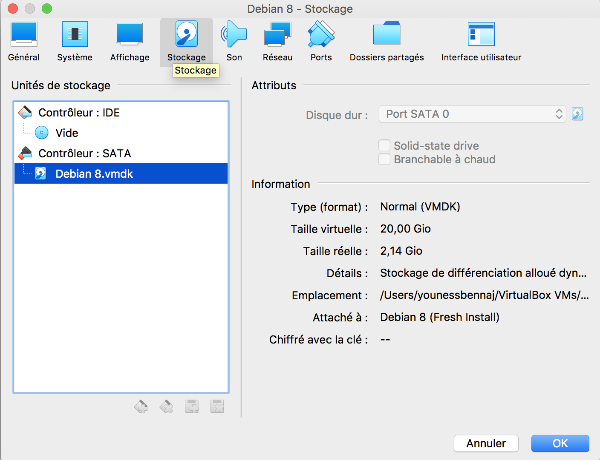
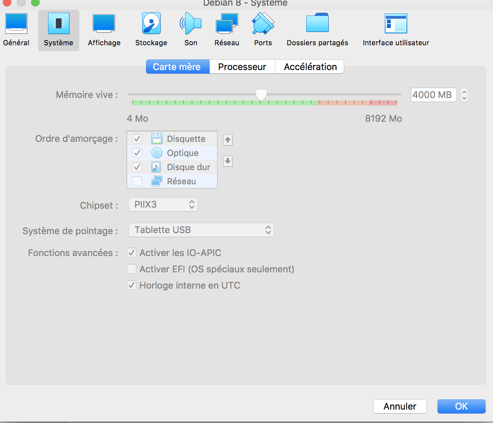
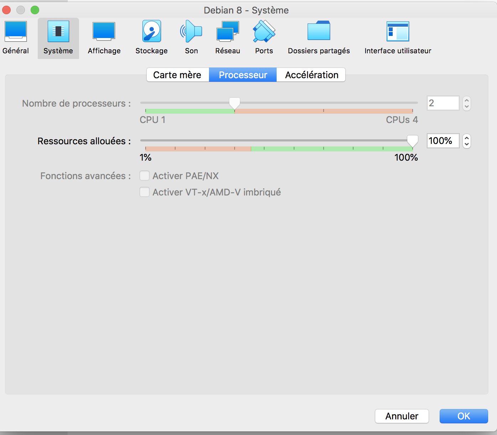
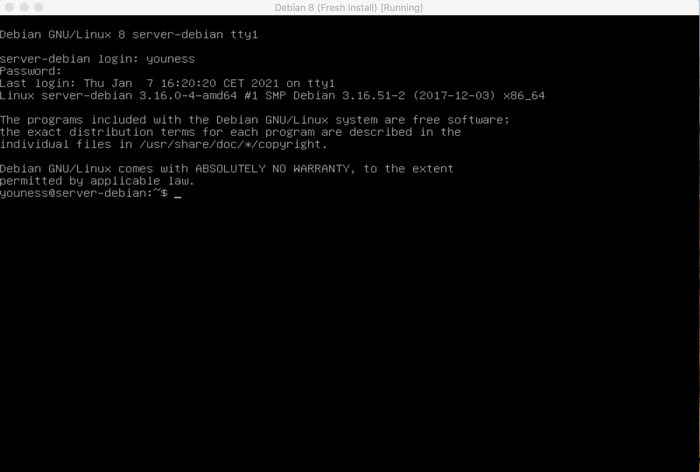
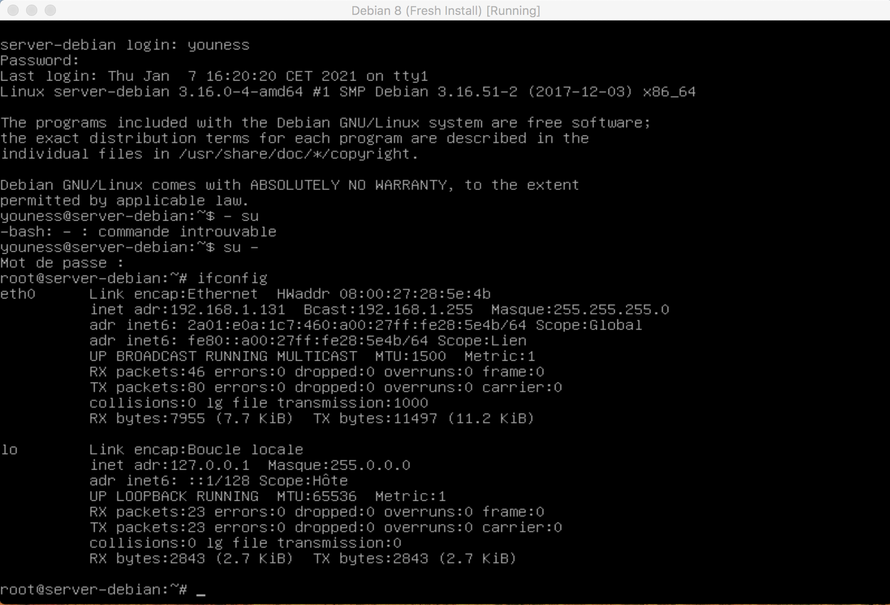
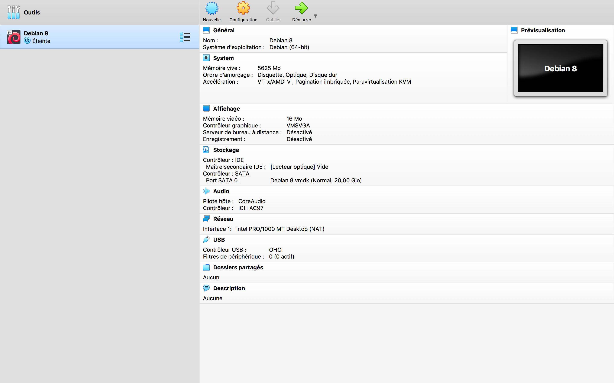

#Projet Devops

## Etape 1: Création de la Virtual Machine

### Virtual Box

J'ai utilisé Virtual Box comme hyperviser (type 2) . C'est le type d'hyperviser recommandé pour les particulier afin d'orchestrer les différentes machines virtuelles en s'appuyant sur l'OS hôte. Il ne s'agit pas d'une virtualisation complète mais d'une para-virtualisation dans le sens ou Virtual Box est installé sur mon OS hôte. 

Nous sommes dans notre cas dans une virtualisation materielle, c'est à dire qu'on va virtualiser les composants hardware de la machine. 

Virtual Box va nous proposer donc une interface graphique nous permettant de créer des machines virtuelles.

On va donc pouvoir se lancer dans la création de notre machine virtuelle.

### Configuration de la VM grâce à VirtualBox 

J'ai utilisé le fichier ISO d'installation du Debian 8 via le lecteur optique de ma machine virtuelle.

Dans la fenêtre configuration je vais d'abord pouvoir paramêtrer les ressources utilisées par ma VM. 

Et je vais également pouvoir paramètrer le mode d'accès réseau: 

Ici j'ai selectionné le mode "Accès par pont" car cela permet de pouvoir prendre le contrôle à distance de mon serveur Debian pour simuler que le serveur n'est pas sur la même machine mais qu'il soit bien à distance. 

Je vais ensuite lancer ma VM et procéder à l'installation et la configuration de Dedian. 

Je vais créer deux utilisateurs: 

| name | role | password |
| ----- | ---- | ----------- |
| root | admin | azerty |
| youness | user | azerty |

J'ai également pris le soin de ne pas installer l'interface graphique. Voici le resultat final et ma console de ligne de commande sur Debian: 

Je vais en projet pour m'identifier comme admin et récupérer l'adresse IP dédié de mon serveur: 

Adresse IP: ***192.168.1.131***

Voici la configuration finale de ma VM utilisant Debian 8 

