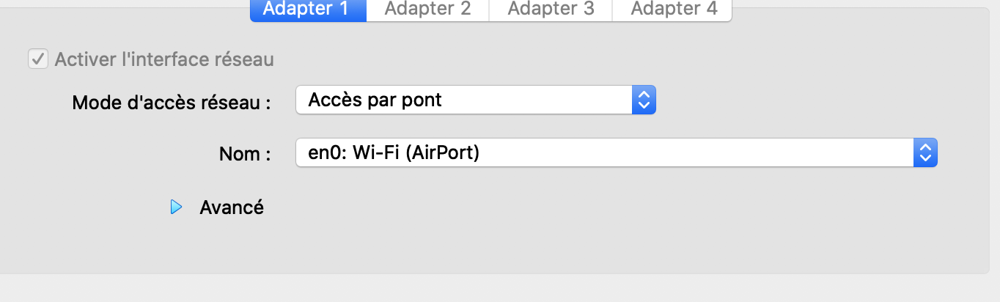
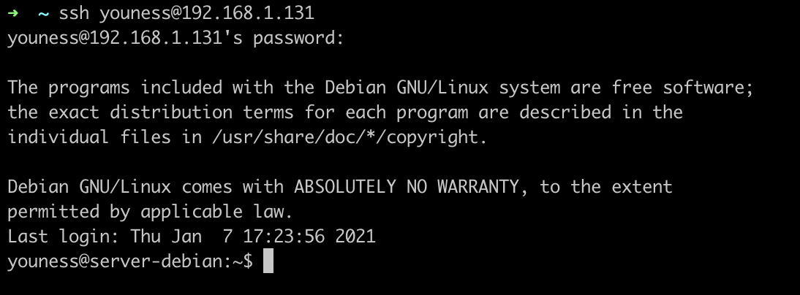
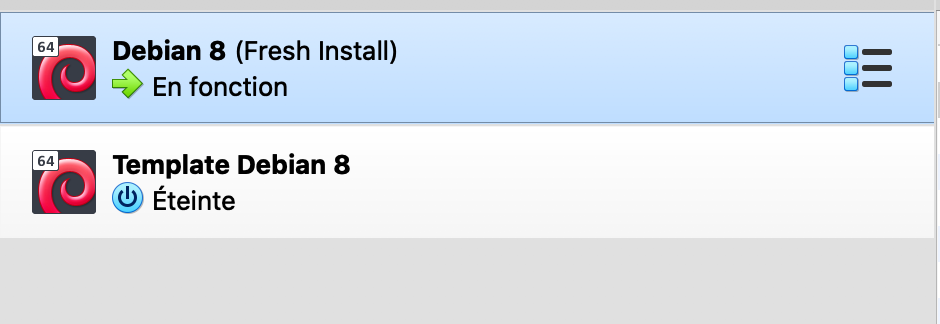
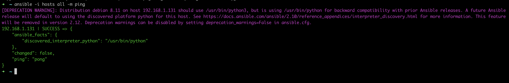
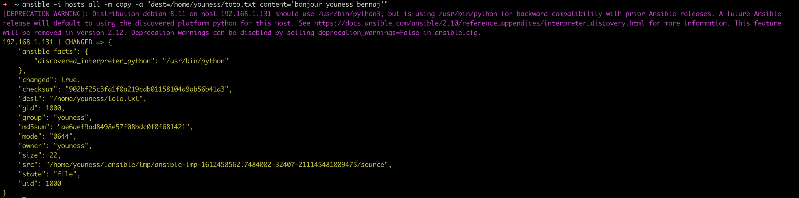
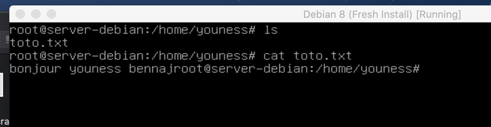
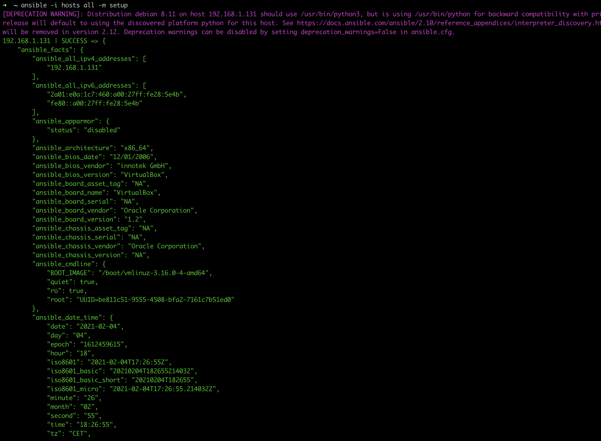

#Projet Devops

## Etape 1: Création de la Virtual Machine

### Virtual Box

J'ai utilisé Virtual Box comme hyperviser (type 2) . C'est le type d'hyperviser recommandé pour les particulier afin d'orchestrer les différentes machines virtuelles en s'appuyant sur l'OS hôte. Il ne s'agit pas d'une virtualisation complète mais d'une para-virtualisation dans le sens ou Virtual Box est installé sur mon OS hôte. 

Nous sommes dans notre cas dans une virtualisation materielle, c'est à dire qu'on va virtualiser les composants hardware de la machine. 

Virtual Box va nous proposer donc une interface graphique nous permettant de créer des machines virtuelles.

On va donc pouvoir se lancer dans la création de notre machine virtuelle.

### Configuration de la VM grâce à VirtualBox 

J'ai utilisé le fichier ISO d'installation du Debian 8 via le lecteur optique de ma machine virtuelle.


Dans la fenêtre configuration je vais d'abord pouvoir paramêtrer les ressources utilisées par ma VM. 


Et je vais également pouvoir paramètrer le mode d'accès réseau: 

Ici j'ai selectionné le mode "Accès par pont" car cela permet de pouvoir prendre le contrôle à distance de mon serveur Debian pour simuler que le serveur n'est pas sur la même machine mais qu'il soit bien à distance. 

Je vais ensuite lancer ma VM et procéder à l'installation et la configuration de Dedian. 

Je vais créer deux utilisateurs: 

| name | role | password |
| ----- | ---- | ----------- |
| root | admin | azerty |
| youness | user | azerty |

J'ai également pris le soin de ne pas installer l'interface graphique. Voici le resultat final et ma console de ligne de commande sur Debian: 


Je vais en projet pour m'identifier comme admin et récupérer l'adresse IP dédié de mon serveur: 


Adresse IP: ***192.168.1.131***

Voici la configuration finale de ma VM utilisant Debian 8 


### Configuration Réseau de ma VM 

Pour la configuration de ma VM j'ai choisi donc un "Accès" par pont pour pouvoir accéder à ma VM comme à une machine distante depuis ma machine via une connexion SSH. 



J'ai ensuite transmis la clé plubique de ma machine à ma VM: 

```
cat ~/ssh/id_rsa.pub | ssh youness@192.168.1.131 "mkdir ~/.ssh -p && cat - >> ~/.ssh/authorized_keys"
```

Je peux maintenat me connecter via une connexion SSH à ma VM: 



### Création de mon template de VM

je peux maintenant créer un template réutilisable de ma VM:



## Commade Ad-hoc 

La moyen le plus facile de débuter avec Ansible est d'utiliser des commandes ad-hoc. Par la suite on pourra voir la syntaxe avec Yaml.

### Etape 1: création de notre cluster 

Notre cluster va être composé de notre machine ansible et de notre machine cliente (notre VM). 

### Etape: Définition de l'inventaire

dans un fichier hosts je vais décrire mon hôte auquel Ansible va pouvoir accéder via une connexion SSH. Dans mon cas il s'agit de la machine virtuelle.

```
192.168.1.131 ansible_user=youness ansible_password=azerty
```

Et je dois rajouter une commande pour préciser à ansible de ne pas checker l'hôte distant.

```
ansible_ssh_common_args='-o StrictHostKeyChecking=no'
```

### Utilisation du module Ping

Je vais maintenant ajouter la commande ad-hoc pour utiliser le module ping

```
ansible -i hosts all -m ping
```

J'obtient un pong en réponse:



### Utilisation du module Copy

Je vais pouvoir copier un fichier texte avec du contenu sur ma machine distante 

J'utilise pour ça la commande: 

```
ansible -i hosts all -m copy -a "dest=/home/youness/toto.txt content='bonjour youness bennaj'"
```



Sur ma VM je retrouve bien le contenu de ce fichier



### Utilisation du module Setup

Je peux également utiliser le module Setup pour obtenir les informations relatives à la machine hôte (distante).

```
ansible -i hosts all -m ping
```




# Etape 2: Création du pipeline pour builder et tester l'application Front

(Cette étape représente mon objectif au sein de l'équipe Devops-7)

# Gitlab 

## Le repository du projet

J'ai d'abord créer un nouveau repo sur l'organisation gitlab de mon groupe. J'ai ajouté à ce repo l'application Angular qui a été fourni dans de ce projet. 


J'ai ensuite créer une configuration pour l'intégration continue via le fichier ```.gitlab-ci.yml```. 

## La config d'intégration continue

```
stages:
  - testing
  - building
  - deploy


test:
  stage: testing
  image: trion/ng-cli-karma:6.2.1
  script:
  - npm install
  - npm run test


build:
  stage: building
  image: trion/ng-cli
  variables:
    CHROME_BIN: google-chrome
    CLI_VERSION: 6.2.1
  script:
    - npm install
    - npm run build

```

Ma configuration comprends 3 ***jobs*** (étapes) différents: testing, building et deploy. Dans la config pour l'instant j'ai ajouté les deux jobs relatifs aux étapes de test et de build qui seront éffectué à chaque push sur le repo gitlab (https://gitlab.retrogala.ovh/ybennaj/angular-app/). 

Pour la phase de test j'utilise l'image trion/ng-cli-karma:6.2.1 qui permet de pouvoir executer l'application dans un environnement d'execution qui comprends les dépendance nécessaire aux tests d'application angular avec karma. 

Pour la phase de build j'utilise une autre image pour les applications Angular plus légère car sans Karma. 

Il me reste encore l'étape de deploy mais je dois attendre le travail de mes camarades sur Ansible. 

Au niveau des commandes du script, j'ai simplement ajouté celle prévu par le projet dans le package.json. 

## Le runner

Pour executer les différents jobs de ma pipeline je vais ensuite faire appel au runner crée par mon équipe. Je vais donc pour ça utiliser ce qu'on appelle les "shared runners" au sein de gitlab. 


On peut voir sur cette image le runner crée par mon organisation et qui va avoir pour rôle d'éxecuter les différents jobs sur ma pipeline front.

## La Pipeline

Je vais donc pouvoir lancer mon intégration continue. On peut voir sur cette image les différentes pipeline qui ont succed ou failed. J'ai fait plusieurs test de config de CI avant de trouver la bonne. J'ai notament eu des difficultés à trouver la bonne image pour l'étape des tests. 


J'ai finalement trouvé la config qui fontionne dans notre cas. Mes deux jobs sont succeed et ma pipeline également.